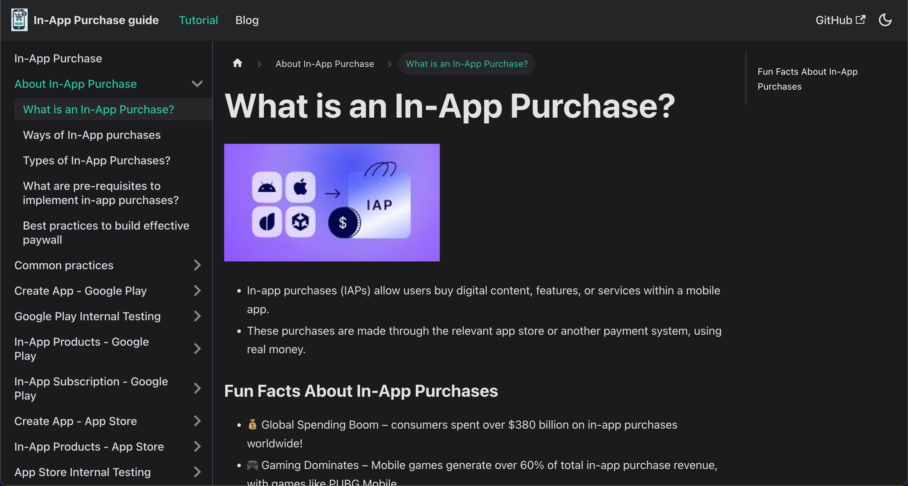

# 📱 In-App Purchase Guide

Your ultimate resource for implementing and managing In-App Purchases (IAP) on both Google Play and the App Store.

### 🚀 Start Learning Now → in-app-purchase-doc.vercel.app

📖 About This Guide

This guide is crafted for:
- Developers implementing in-app purchases.
- Clients & Product Teams managing app monetization.
- Flutter teams shipping across platforms efficiently.

Whether you're setting up your first subscription or testing IAP flows, this resource covers it all—from setup to best practices.

---

## 🧭 What’s Inside

**📌 General Purpose**
- Overview of in-app purchases
- Client-developer sync for monetization goals

**💸 Built for Seamless Monetization**
- Best practices
- Common mistakes to avoid
- Revenue optimization strategies

**🔄 End-to-End Store Integration**
- Google Play & App Store setup
- Product/subscription configuration
- Internal testing and review process

---
## 🪄 Guide Breakdown

- About In-App Purchase
- Common Practices
- Create App – Google Play
- Google Play Internal Testing
- In-App Products – Google Play
- In-App Subscription – Google Play
- Create App – App Store
- In-App Products – App Store
- App Store Internal Testing
- Auto-Renewable Subscription – App Store
- Non-Renewing Subscription – App Store
- Subscription Cancellation
- Test In-App Purchases
- Cross-Platform Compatibility
- Keep Building!

----

# 👥 Contributing
Pull requests are welcome! If you find issues or want to add missing sections, feel free to open an issue or submit a PR.
